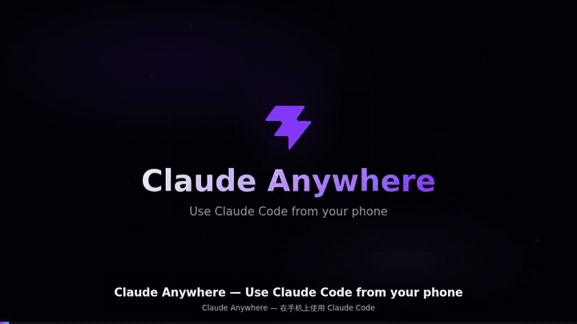

# Claude Anywhere

[English](#english) · [中文](#中文)

---

<a id="english"></a>

## Use Claude Code from your phone

**Turn Claude Code into an OpenClaw — it works while you lounge in bed.**

<p align="center">
  
</p>

Claude Anywhere wraps the [Claude Code](https://docs.anthropic.com/en/docs/claude-code) CLI in a mobile-friendly web UI. Run it on your computer, access it from any browser — no app install needed. Lie back, tap, ship.

### Why Claude Anywhere?

- **Full Claude Code on mobile** — everything you can do in the terminal, now on your phone
- **Real-time streaming** — SSE-based, see responses as they're generated
- **Permission controls** — approve or reject tool calls with one tap
- **Session history** — all past conversations, synced with Claude Code's own storage
- **File preview** — tap any file path to see its contents
- **Slash & mention completion** — `/` for skills, `@` for files, just like the CLI
- **Bilingual UI** — English / 中文 toggle in the sidebar
- **Zero external database** — sessions live in `~/.claude/`, nothing extra to manage

### Quick Start

#### 1. Install prerequisites

**Claude Code CLI**

```bash
# All platforms (requires Node 20+)
npm install -g @anthropic-ai/claude-code
```

> First time? Run `claude` in terminal to complete login.

**uv** (Python package manager)

```bash
# macOS / Linux
curl -LsSf https://astral.sh/uv/install.sh | sh

# Windows (PowerShell)
powershell -ExecutionPolicy ByPass -c "irm https://astral.sh/uv/install.ps1 | iex"
```

> Requires Python 3.12+ and Node 20+.

#### 2. Install Claude Anywhere

```bash
git clone https://github.com/deepslit/claude-anywhere.git
cd claude-anywhere
uv sync
cd web && npm install && npm run build && cd ..
```

#### 3. Configure

```bash
cp config.example.toml config.toml
```

Edit `config.toml` — add the directories you want Claude to work in:

```toml
[[allowed_dirs]]
name = "My Project"
path = "/path/to/your/project"
```

#### 4. Run

```bash
uv run python -m claude_anywhere
```

Open `http://127.0.0.1:21580` in your browser. The terminal prints an API key on first launch — enter it to log in.

---

### Access from your phone

#### Option A — Same WiFi (LAN)

```bash
uv run python -m claude_anywhere --host 0.0.0.0
```

Open `http://YOUR_COMPUTER_IP:21580` on your phone. Both devices must be on the same network.

#### Option B — Cloudflare Tunnel (no public IP needed)

```bash
# Install cloudflared
#   macOS:   brew install cloudflared
#   Linux:   download .deb/.rpm from https://github.com/cloudflare/cloudflared/releases
#   Windows: winget install --id Cloudflare.cloudflared

# Terminal 1: start Claude Anywhere
uv run python -m claude_anywhere --host 127.0.0.1

# Terminal 2: start tunnel
cloudflared tunnel --url http://127.0.0.1:21580
```

You'll get a `https://xxx.trycloudflare.com` URL — open it on your phone. HTTPS built-in.

> Quick tunnel URLs change on restart. For a permanent URL, see [Cloudflare named tunnels](https://developers.cloudflare.com/cloudflare-one/connections/connect-apps).

#### Option C — Public IP server

```bash
uv run python -m claude_anywhere --host 0.0.0.0
```

Open `http://YOUR_SERVER_IP:21580`. Note: this is plain HTTP — only use on trusted networks.

---

### API Key

- Generated on first launch, saved to `.api-key` in the project root
- Printed to the terminal — copy and paste into the browser
- To reset: delete `.api-key` and restart

### Permission Modes

| Mode | Behavior |
|------|----------|
| **Ask before editing** (default) | Every tool call shows an approval card |
| **Auto-accept edits** | File edits pass through automatically; Bash still asks |
| **Plan mode** | Model writes a plan; you approve before execution |
| **Allow all** | No prompts at all — sandbox use only |

### Configuration

All settings in `config.toml`:

```toml
host = "0.0.0.0"        # bind address; use 127.0.0.1 for local only
port = 21580

# claude binary path (auto-detected from PATH if omitted)
# claude_bin = "/usr/local/bin/claude"

[[allowed_dirs]]
name = "My Project"
path = "/path/to/your/project"
```

### TODO

- [ ] Web support for `/compact` — compress context from web UI
- [ ] Web support for `/model` — switch model from web UI
- [ ] Web support for `/cost` — show token usage per session
- [ ] Web support for `/context` — show context window usage
- [ ] Key rotation UI
- [ ] Multi-user support
- [ ] Audit logging

### Development

```bash
# Terminal 1: backend with hot reload
uv run python -m claude_anywhere --host 127.0.0.1 --reload

# Terminal 2: frontend with Vite HMR
cd web && npm run dev
# Open http://localhost:5173 — API calls are proxied to the backend
```

---

<a id="中文"></a>

## 在手机上用 Claude Code

**躺在床上发号施令，让 Claude Code 变成你的 OpenClaw。**

<p align="center">
  
</p>

Claude Anywhere 给 [Claude Code](https://docs.anthropic.com/en/docs/claude-code) 命令行套了一个手机友好的网页界面。电脑上跑，手机浏览器打开就能用，不用装 app。躺平，点点，交付。

### 亮点

- **手机上完整体验 Claude Code** — 终端里能做的，手机上都能做
- **实时流式输出** — 基于 SSE，边生成边显示
- **权限审批** — 工具调用一键允许/拒绝
- **历史会话** — 自动读取 Claude Code 原有会话记录
- **文件预览** — 点击文件路径直接查看内容
- **`/` 和 `@` 补全** — `/` 联想 skills，`@` 联想工作目录文件
- **中英双语界面** — 侧边栏一键切换
- **零外部依赖** — 会话存在 `~/.claude/` 里，不需要数据库

### 快速开始

#### 1. 安装前置依赖

**Claude Code CLI**

```bash
# 所有平台（需要 Node 20+）
npm install -g @anthropic-ai/claude-code
```

> 首次使用？在终端运行 `claude` 完成登录。

**uv**（Python 包管理器）

```bash
# macOS / Linux
curl -LsSf https://astral.sh/uv/install.sh | sh

# Windows (PowerShell)
powershell -ExecutionPolicy ByPass -c "irm https://astral.sh/uv/install.ps1 | iex"
```

> 需要 Python 3.12+ 和 Node 20+。

#### 2. 安装 Claude Anywhere

```bash
git clone https://github.com/deepslit/claude-anywhere.git
cd claude-anywhere
uv sync
cd web && npm install && npm run build && cd ..
```

#### 3. 配置

```bash
cp config.example.toml config.toml
```

编辑 `config.toml`，填上你想让 Claude 工作的目录：

```toml
[[allowed_dirs]]
name = "我的项目"
path = "/path/to/your/project"
```

#### 4. 启动

```bash
uv run python -m claude_anywhere
```

浏览器打开 `http://127.0.0.1:21580`。首次启动终端会打印 API key，输入即可登录。

---

### 手机访问

#### 方式 A — 局域网（同一 WiFi）

```bash
uv run python -m claude_anywhere --host 0.0.0.0
```

手机浏览器打开 `http://电脑IP:21580`，电脑和手机需在同一网络。

#### 方式 B — Cloudflare Tunnel（没有公网 IP）

```bash
# 安装 cloudflared
#   macOS:   brew install cloudflared
#   Linux:   从 https://github.com/cloudflare/cloudflared/releases 下载 .deb/.rpm
#   Windows: winget install --id Cloudflare.cloudflared

# 终端 1：启动 Claude Anywhere
uv run python -m claude_anywhere --host 127.0.0.1

# 终端 2：启动隧道
cloudflared tunnel --url http://127.0.0.1:21580
```

终端会显示一个 `https://xxx.trycloudflare.com` 地址，手机打开即可。自带 HTTPS。

> Quick tunnel 每次重启 URL 会变。想要固定域名，参考 [Cloudflare named tunnels](https://developers.cloudflare.com/cloudflare-one/connections/connect-apps)。

#### 方式 C — 公网 IP 服务器

```bash
uv run python -m claude_anywhere --host 0.0.0.0
```

手机打开 `http://服务器IP:21580`。注意：这是明文 HTTP，仅适合可信内网。

---

### API Key

- 首次启动自动生成，保存在项目根目录的 `.api-key` 文件
- 同时打印到终端 — 复制粘贴到浏览器即可
- 想换新的：删除 `.api-key` 文件，重启服务

### 权限模式

| 模式 | 行为 |
|------|------|
| **编辑前先问**（默认） | 每次工具调用弹卡片让你审批 |
| **自动接受编辑** | 文件编辑自动放行；Bash 等仍弹确认 |
| **计划模式** | 模型先写计划，你批准后才执行 |
| **全部允许** | 不弹任何确认 — 仅限沙箱环境 |

### 配置

所有设置在 `config.toml` 中：

```toml
host = "0.0.0.0"        # 监听地址；仅本地用 127.0.0.1
port = 21580

# claude 可执行路径（默认从 PATH 自动找）
# claude_bin = "/usr/local/bin/claude"

[[allowed_dirs]]
name = "我的项目"
path = "/path/to/your/project"
```

### TODO

- [ ] Web 端支持 `/compact` — 从网页压缩上下文
- [ ] Web 端支持 `/model` — 从网页切换模型
- [ ] Web 端支持 `/cost` — 显示每会话 token 用量
- [ ] Web 端支持 `/context` — 显示上下文窗口用量
- [ ] API Key 轮换 UI
- [ ] 多用户支持
- [ ] 审计日志

### 开发模式

```bash
# 终端 1：后端 hot reload
uv run python -m claude_anywhere --host 127.0.0.1 --reload

# 终端 2：前端 Vite HMR
cd web && npm run dev
# 浏览器 http://localhost:5173 — API 请求自动代理到后端
```
